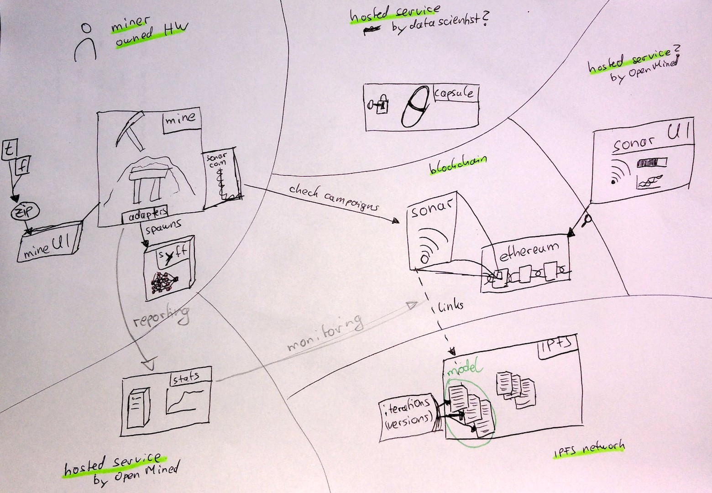

 # System overview
 
<!-- TOC -->

- [Component interfaces](#component-interfaces)
    - [syft](#syft)
        - [Use case: Model creation @Data Scientist](#use-case-model-creation-data-scientist)
        - [Use case: Train the model @Mine](#use-case-train-the-model-mine)
    - [pySonar](#pysonar)
    - [Sonar](#sonar)
    - [Capsule](#capsule)
    - [Mine.js](#minejs)

<!-- /TOC -->

 

## Component interfaces

This list should focus on the individual components interfaces not so much their role in the system but rather what they need to work individually.

### syft

#### Use case: Model creation @Data Scientist

**▶️In**
* Data Scientists decision

**Out🏁**
* initial model/weights
  * HE enrypted

#### Use case: Train the model @Mine

**▶️In**
* user data
* input & target data
* (latest) model weights

**Out🏁**
* gradients

### pySonar

**▶️In**

**Out🏁**

### Sonar

**▶️In**
* new models
  * owner
  * IPFS address of the model
* gradient updates
  * IPFS address
  * miner
* 

**Out🏁**
* model listing
  * source data requirements
  * bounty
  * state (in training)
  * getLatestModel

### Capsule

**▶️In**
* encrypted stuff

**Out🏁**
* decrypted stuff

### Mine.js

**▶️In**
* list of `models`
  * state: still in training?
  * data source: can the Mine train this model?
  * (bounty: is it worth training?)
* (latest) model weights
* user data

**Out🏁**
* gradients
* (list of available data)
