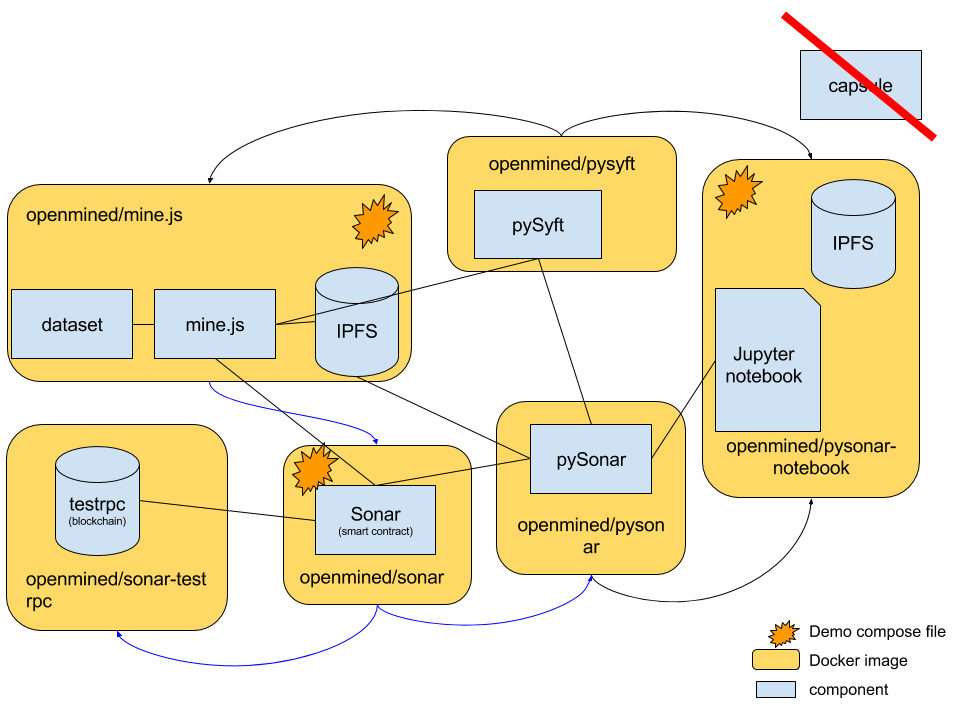

# 2017-08-12 Docker architecture

## Purpose

Discuss which how to progress with Docker development within the platform.

## Decisions

* [x] What docker images to create?

* [x] How to automate image creation?
  * dockerhub automated builds
  * initially CircleCI was in discussion but due to the huge amount of dependencies within the platform it might be highly beneficiary to use dockerhub automated builds directly. They automatically retrigger new builds if a base image is changed. With CI-based builds we would have to trigger all dependants manually.
* [x] When should images be created?
    * `develop` is tagged as `:edge` image
    * `master` is `:latest`
    * each image should have a unique id (in combination with the image name)
* [x] How to tag/release?
    * commit based tags as mentioned above
    * additional tags per milestone
    * when going master
    * add git tag -> automatically build tagged docker images
    * tag name = milestone name
* [x] What compose files should we have?
    * most likeone one top level compose file that bootstraps mine, sonar, syft notebook
    * the compose file should be located within the `pySyft` repository

> Use libraries as static images (no `CMD`/`ENTRYPOINT`) to build larger images

## Open issues

Things we couldn't discuss in full detail / clarify.

* Issue (low prio): Put `Sonar` into seperate static image to be required for pySonar/Mine builds to distribute the `.abi` file
* figure out how to add unique tags to each build (also considering that builds might be re-triggered when base images change i.e. no code change)
* ~~Can dockerhub autodeploy handle multiple dockerfiles in one repo (and how?)~~ > Yes, you can specify the names/locations of Dockerfiles on dockerhub