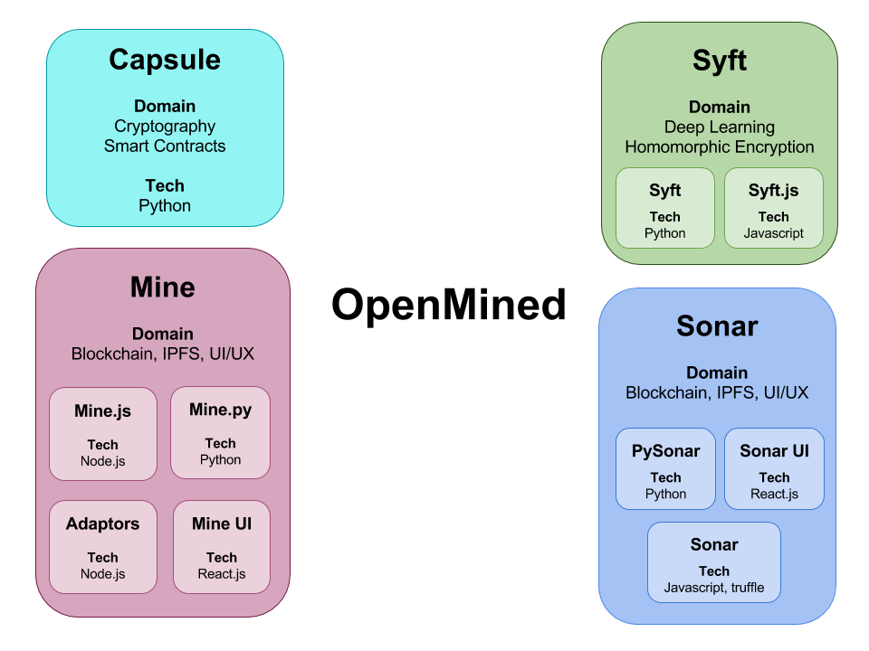

# Documentation

> all kinds of 📚 for OpenMined

OpenMined is a community of volunteers focused on building open source technology facilitating the decentralized ownership of data and intelligence. This repository should provide helpful links to all available documentation.

<!-- TOC depthFrom:2 -->

- [Overview](#overview)
    - [Slides](#slides)
    - [Glossary](#glossary)
    - [Components](#components)
    - [Repositories](#repositories)
    - [Workflow](#workflow)
    - [Incentives](#incentives)
- [Sequential view](#sequential-view)
- [Contributing](#contributing)
- [Website & Official Accounts](#website--official-accounts)
- [Meetings](#meetings)
- [Resources](#resources)
    - [Federated Learning](#federated-learning)
- [License](#license)

<!-- /TOC -->
## Overview

### Slides
- [OpenMined Introduction Slides](https://docs.google.com/presentation/d/1Tm7jh3pChks0ObJNb7x2ZZhhVOJhmCVN2KDPWyZohQU/edit)

### Glossary

- **Model** - a neural network capable of learning to translate one dataset (i.e. tweets) into another (i.e. positive/negative sentiment predictions)

- **Data Scientist** - An individual (often part of an Organization) interested in training a Model on data that they do not have direct access to.

- **Miner** - An individual or organization interested in selling statistical access to their data.

- **Data "Mine"** - A Mine is a repository of data that is in complete control of a Miner.  The Miner owns this data 100% and the right to do with it whatever they please.  At no point in this process does this individual send a copy of the data to anyone. The mine can be located anywhere that is in complete control by the user (mobile phone, local desktop, or non-shared cloud instance).

- **Model Repository** - Stored on the Blockchain (via IPFS), this is the collection of models that are available for training. All models are homomorphically encrypted using keys that are owned by the Capsule Oracle Service.

- **Gradient** - The differential of change of a Model after it has been mined by a Miner.

- **Campaign** - An initiative started by a Data Scientist to train a Model.

- **Bounty** - The amount of money a Data Scientist puts forth into training a Model which is later distributed amongst the mines involved in training the Model.

### Components

- **Sonar** - A federated learning server running on the blockchain that handles all campaign requests, holding Bounty in trust.  This library communicates with the Capsule to generate PGP keys and deliver the final, trained results back to the Data Scientist. It also communicates with miners, collecting Gradients and distributing Bounty accordingly.

- **Capsule** - A third-party PGP server to generate public and private keys in order to ensure that Sonar neural network stays encrypted properly.

- **Mine** - The individual data repositories of a user.  These are constantly checking Sonar for new neural nets to contribute to.  The more data that is uploaded to a mine, the more relevant it becomes to Sonar.  All the mines in the “minefield” are competing against each other to train a Sonar neural network if they contain applicable data.  Sonar does not know of these mines, but they all know of Sonar - it’s a unidirectional relationship for security purposes.

- **Syft** - The library containing Neural Networks that can be trained in an encrypted state (so that Miners can’t steal the neural networks that they download to train).

### Repositories

- **Capsule** _(Python)_  
PGP key generator, also responsible for delivering the trained and decrypted dataset back to data scientist

- **Sonar** _(Solidity/Truffle)_  
Blockchain contracts holds all IPFS addresses for neural networks

- **PySonar** _(Python)_  
Python data science library for training models over the platform

- **Sonar UI** _(React.js)_  
for creating campaigns and monitoring campaign progress/spend

- **Mine.py** _(Python)_  
Python Server side for storing data and retrieving models from Sonar (identical functionality to Mine.js)

- **Mine.js** _(Node.js)_  
Javascript Server side for storing data and retrieving models from Sonar (identical functionality to Mine.py)

- **Mine UI** _(React.js)_  
User interface for monitoring mine usage, setting permissions, etc.

- **Syft** _(Python)_  
Machine learning, called from Mine’s server side

- **Adapters** _(Node.js)_  
Converting external data sources into OpenMined schemas

- **Statistics and usage service** _(Node.js)_  
Scripts/API that exposes public mine/sonar activity for analysis.

### Workflow
The OpenMined platform starts with a Data Scientist creating a request to Sonar in order to begin a mining campaign.  The Data Scientist defines some basic parameters:

**Bounty**  
The amount of money the Data Scientist is willing to spend in order the train their model

**Input**  
A description of the data being requested from the mines (i.e. tweets of a user) including the schema.

**Output**  
A description of the desired output data given the input (i.e. recommended hashtags for a tweet) including the schema.

**Starting Accuracy**  
A claim to the initial accuracy of the default model evaluated on a validation dataset owned by Data Scientist.

**Target Accuracy**  
*(Default - 0% error)*  
The desired accuracy a dataset should attain once it has been trained by mines, evaluated on the same validation dataset owned by Data Scientist.

**Algorithm (optional)**  
A model in Syft chosen by the Data Scientist with the option of defining initial weight positions (in case Data Scientist wants to start the campaign with a model from a different
campaign).

A neural network is generated from this campaign and placed on the Sonar blockchain.  Sonar then communicates with Capsule which generates a public key and a private key (for Homomorphic Encryption) using PGP encryption.  The public key is then sent back to Sonar and stored with the neural network. The private key is kept secret in Capsule. At this point, Mines are able to pull down the Model (neural network) and attempt to train it.  Upon completion of training, the computed gradient is then uploaded back to the Sonar blockchain.  At this point, it can be determined how much the uploaded gradient affected the accuracy of the Model.  

For instance, if the initial accuracy of the dataset before training takes place is at 0% (meaning it’s never been trained before) and the first mine to attempt the training increases the accuracy to 2%, then that mine is responsible for a 2% increase in the accuracy of the gradient and will receive 2% of the bounty.

After all mining has been completed and the dataset is sufficiently trained by numerous mines, the encrypted dataset is sent to Capsule to be decrypted using the private key and is then delivered to the Data Scientist.  At such point, we begin issuing payouts to all the responsible mines.  Using an example: if the bounty was set at $1,000 with an accuracy threshold of 80%, then a 2% increase in the accuracy would yield a 2.5% relative accuracy increase and that mine’s payout would be $25.  The formula is as such: (total accuracy increase / desired accuracy) x total bounty.

### Incentives
Data Scientists are incentivized to have high bounties because it means that the competing mines reap a larger payout.  A higher bounty means that a dataset will be trained quicker because mines will see it as advantageous.  Low bounties would be seen as a “waste of resources” by mines and therefore would take a lot longer to train.

It’s also advantageous for a mine to begin training a dataset as soon as possible since the potential change gradient is higher at the beginning of training.

Sonar is not aware of the mines before training, only the mines are aware of Sonar.  The mines are also not aware of the resources of each other, but yet they’re in direct competition.  This means that the larger and more varied a mine is in the data it contains, the greater chance it has to make an impact on a neural network.  This also means that miners (average people) are incentivized to upload as much personal data as possible into the mine.
The earliest creators of mines will also reap the largest benefits, as is commonly the case with distributed blockchains.

## Sequential view

## Contributing

For first timers go to the [quick start guide](./contributing/quickstart.md)

If you are ready to dive in and start contributing, check out our [guidelines](./contributing/guidelines.md) beforehand.

## Website & Official Accounts

The official **OpenMined** website is available at [openmined.org](http://openmined.org).

**OpenMined** organizational accounts:

* Continuous Integration: [Travis CI](https://travis-ci.org/OpenMined), [CircleCI](https://circleci.com/gh/OpenMined)
* Code Coverage: [Codecov](https://codecov.io/gh/OpenMined)
* Sourcecode: [Github](https://github.com/OpenMined)
* Artifact registries: [NPM](https://www.npmjs.com/org/openmined), [Dockerhub](https://hub.docker.com/u/openmined/)

## Meetings

All public meetings are posted to the [meetings](./meetings) folder.

## Resources

### Federated Learning

#### Papers

* Google, [Federated Learning:
Strategies for Improving Communication Efficiency](https://arxiv.org/pdf/1610.05492.pdf)
* Google, [Communication-Efficient Learning of Deep Networks from Decentralized Data](https://arxiv.org/pdf/1602.05629.pdf)
* Google & University of Edinburgh, [Federated Optimization: Distributed Machine Learning for On-Device Intelligence](https://arxiv.org/pdf/1610.02527.pdf)

#### Blogs

* Google, [Federated Learning: Collaborative Machine Learning without Centralized Training Data](https://research.googleblog.com/2017/04/federated-learning-collaborative.html)

## License

[CC BY-SA 4.0](https://creativecommons.org/licenses/by-sa/4.0/)
